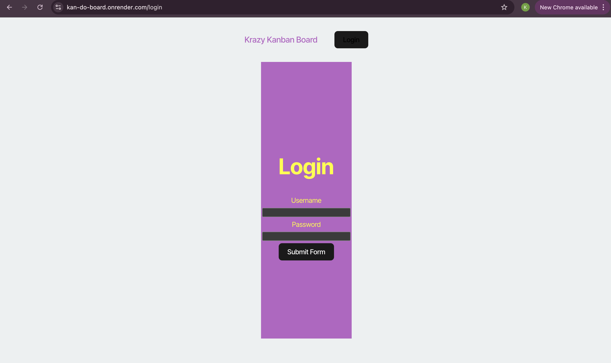
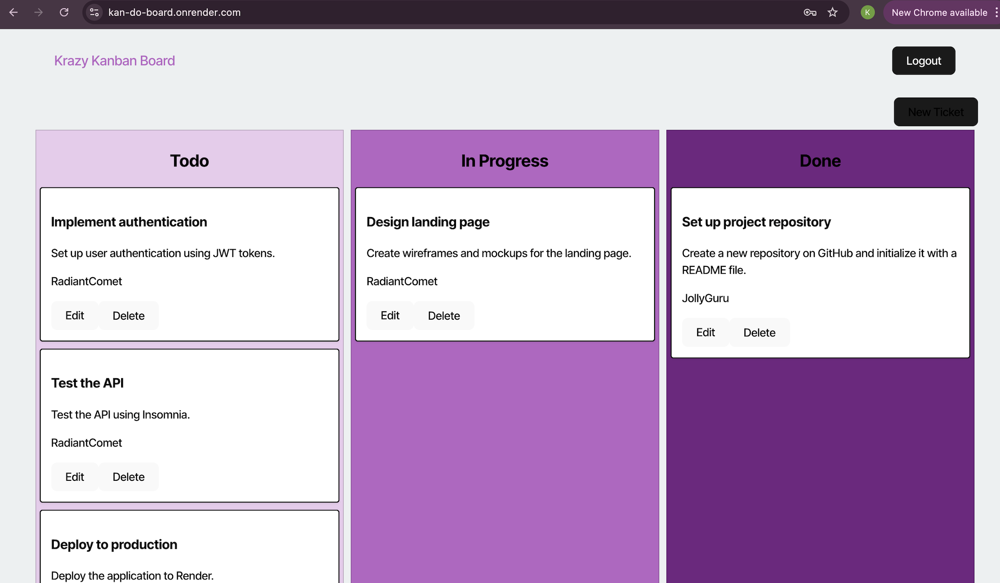

# Kan-Do-Board

  ## Description
  This project integrates Authentication with JSON Web Tokens (JWT) into an existing Kanban board application. JWTs provide a secure and scalable mechanism for verifying user identities in full-stack applications, enhancing both security and user experience.

  ## Table of Contents
  - [Installation](#installation)
  - [Usage](#usage)
  - [Screenshots](#screenshots)
  - [Deployed Application](#deployed-application)
  - [Questions](#questions)
  - [Resources](#resources)

  ## Installation
  1. ### Clone the repository:

     * `git clone https://github.com/Kristenshields/Kan-Do-Board.git`

  2. ### Navigate to root directory:

     * `cd Kan-Do-Board/Develop`

  3. ### Install dependencies:

     * run the following command: `npm install`

  4. ### set up postgreSQL in .env file:

    create a .env file in the server directory with the following:

  - `DB_NAME='kanban_db'`
  - `DB_USER='' (your postgreSQL username)`
  - `DB_PASSWORD='' (your postgreSQL password)`
  - `JWT_SECRET_KEY='' (it can be whatever you want)`

  5. ### Start the application:

    * run the following command to start the app: `npm run start:dev`

  6. ### View the application:

     * Open http://localhost:3000/ in your browser to view the application

  ## Usage
  - Add, 
  - update, 
  - and delete tasks.

  ## Screenshots
 
  
  
  

  ## Deployed Application

  https://kan-do-board.onrender.com

 
  ## Questions
  For any questions, feel free to reach me via:
  - GitHub: https://github.com/Kristenshields/
  - Email: shieldskristen0@gmail.com

  ## Resources
  Chat GPT, and a big help was one of my classmates Michael.
